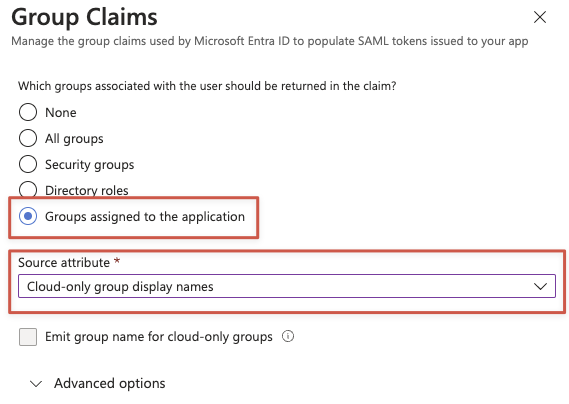

# Single sign-on (SSO)

### Introduction


This feature is available only in the `Enterprise` plan and must be configured with the support team.


Brainboard offers SAML integrations to Enterprise accounts so that admins can easily manage users' access via their IDP

We support both `SAML 2` (recommended) & `OIDC`.

Brainboard's SAML integration allows you to connect Brainboard to your IDP so all users in your Brainboard organization can quickly and securely authenticate thought your IDP using SSO. New users will automatically be created in Brainboard when they sign in for the first time after being allowed in your IDP.

Once SSO is enabled for your organization, you will have your own tenant at Brainboard with a dedicated URL with the following format: `https://xxx.app.brainboard.co`

### Setup

#### 1. Tenant information

To get your tenant, you must reach out to the support team.

It might be shared by Brainboard team via email before the first onboarding session.

#### 2. Set up SAML or OIDC in your IDP



We support SAML 2.0 standard.

Information needed to configure the SAML connection in your IDP:

| Identifier (Entity ID) | https://auth.brainboard.co/realms/{TENANT}                      |
| ---------------------- | --------------------------------------------------------------- |
| Reply/Assertion URL    | https://auth.brainboard.co/realms/{TENANT}/broker/saml/endpoint |
| Sign on URL            | https://{TENANT}.app.brainboard.co                              |




1. During the app creation, you need to allow the following redirect\_uri: https://auth.brainboard.co/realms/{TENANT}/broker/microsoft/endpoint
2. Then please share the following information:
   * Tenant ID
   * Application ID
   * Secret value (You can use [https://privatebin.brainboard.co](https://privatebin.brainboard.co/) and send our team the link after)

If you need any help, reach out to our team.




Do not forget to replace `{TENANT}` with your tenant shared by the team.


Brainboard will configure automatically the following mappers (Azure Entra ID standard):

<table><thead><tr><th width="164.4921875">User attribute</th><th width="97.78125">Required</th><th width="599.6875">Attribute Name</th></tr></thead><tbody><tr><td>email</td><td>Required</td><td><code>http://schemas.xmlsoap.org/ws/2005/05/identity/claims/emailaddress</code></td></tr><tr><td>firstname</td><td>Required</td><td><code>http://schemas.xmlsoap.org/ws/2005/05/identity/claims/givenname</code></td></tr><tr><td>lastname</td><td>Required</td><td><code>http://schemas.xmlsoap.org/ws/2005/05/identity/claims/surname</code></td></tr><tr><td>groups (see below)</td><td>Optional</td><td><code>http://schemas.microsoft.com/ws/2008/06/identity/claims/groups</code></td></tr><tr><td>organization_role</td><td>Optional</td><td><code>organization_role</code></td></tr></tbody></table>

#### 3. Automatic team provisioning and association from IDP Groups \[Optional]

Brainboard supports automatic teams provisioning and association.

Every time users log in, they will be assigned to their respective team using the IDP Groups. The team will be created if it doesn't exist yet.

The following instructions are for Azure Entra ID, but please reach out to our support team to configure your specific provider:

* In Azure Entra ID, open the `Enterprise Application` - `Single sign-on`
* Edit the `Attributes & Claims`
* Add a `Group claims` with the following configuration:
  * Groups assigned to the application
  * Source attribute: cloud-only group display names\
    (or any option to share a friendly name to Brainboard — this attribute will be used for Teams' names)

<figure><figcaption>
Azure Entra ID - Group claims
</figcaption></figure>

#### 4. Share your IDP metadata

To finalize the configuration, you must share your IDP metadata (URL or XML file) to Brainboard support team.

The team will get back to you to confirm your new tenant URL and run a few tests if needed.

