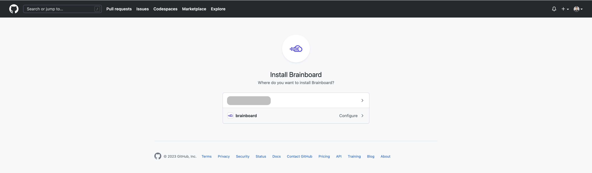
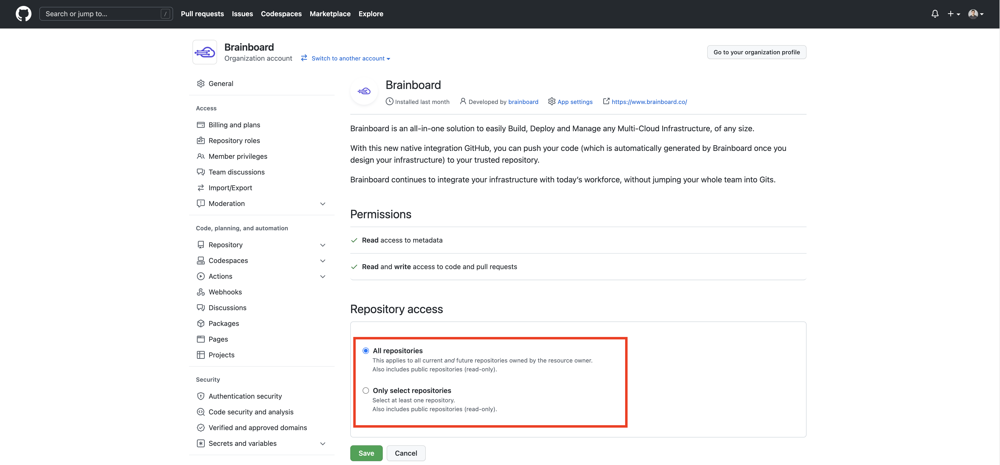
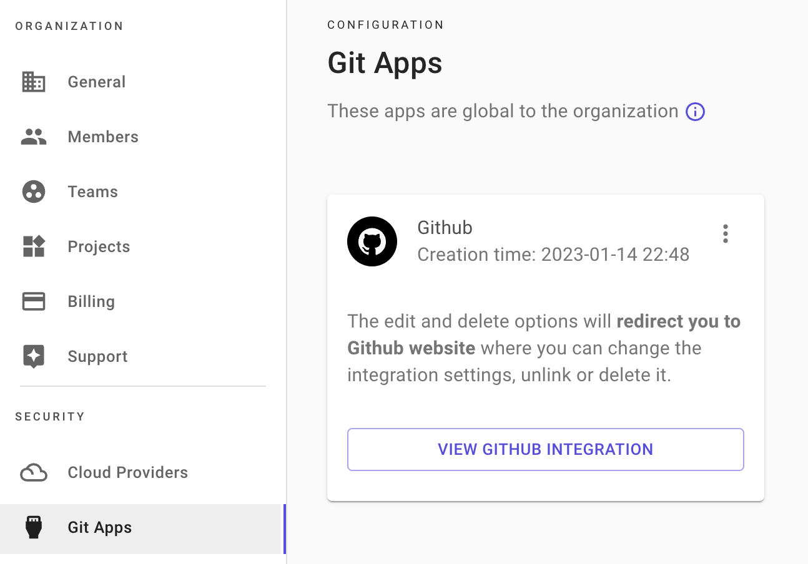

# Git apps

### Description

Git app integration is a mechanism that allows you to control access to repositories and users from your git provider and not inside Brainboard.

Which means that with this integration, users don't use their personal git tokens.

When doing Pull Requests, Brainboard sends the information on behalf of the user creating the PR to be able to track who does what. Refer to [Pull Requests](https://gitlab.com/brainboard/brainboard/-/blob/main/git-configuration/pull-requests/README.md) page for more information about how it works.

#### Supported git providers

Here are the supported git providers that provide git app integrations:

* GitHub.
* Azure DevOps (coming soon).


If you use another git provider (`Gitlab`, `Azure DevOps` and `Bitbucket`), please refer to [this page](https://gitlab.com/brainboard/brainboard/-/blob/main/git-configuration/personal-git-tokens/README.md) for integration.


### Configure GitHub integration

To create integration between Brainboard and GitHub:

1. Go to the [Git apps](https://app.brainboard.co/settings/git-apps) settings page.
2.  Click on `Add GitHub integration` button:&#x20;

    <figure><figcaption></figcaption></figure>
3.  You'll be redirected to the GitHub website, where you can choose the organization for which you want to configure access:&#x20;

    <figure><figcaption></figcaption></figure>
4.  After selecting the organization, you are prompted to specify the repositories:&#x20;

    **N.B:** Brainboard requires `read-write` access to be able to do pull requests.\

    <figure><figcaption></figcaption></figure>
5. After selecting the repositories, you'll be automatically redirected to Brainboard Git app settings page. Now the button should have changed to `View GitHub integration`. &#x20;


Brainboard Enterprise SSO users: If your organization uses Brainboard Enterprise SSO for authentication, the redirection to Brainboard app will fail after selecting the repositories. In this case, please contact our support to update your GitHub `installation_id`.


<figure><figcaption></figcaption></figure>

Once your GitHub integration is configured, please [create a personal GitHub token](https://gitlab.com/brainboard/brainboard/-/blob/main/frontend/docs/docs/git-configuration/personal-git-tokens/README.md#github) in the [personal git tokens](https://app.brainboard.co/settings/personal-git-tokens) settings page to be able to use GitHub features in Brainboard.

### Edit GitHub integration

To edit the GitHub integration:

1. Go to the [Git apps](https://app.brainboard.co/settings/git-apps) settings page.
2.  Either click on `View GitHub integration` button:&#x20;

    Or click on the three dots located in the top-right, then click on `Edit integration`:&#x20;

    <figure><figcaption></figcaption></figure>

    <figure><figcaption></figcaption></figure>
3. You'll be redirected to the GitHub website, where you can edit the integration with Brainboard.

### Delete GitHub integration

To delete integration with GitHub:

1. Go to the [Git apps](https://app.brainboard.co/settings/git-apps) settings page.
2.  Click on the three dots located in the top-right, then click on `Delete integration`:&#x20;

    <figure><figcaption></figcaption></figure>
3. You'll be redirected to the GitHub website, where you can delete the integration with Brainboard.

The update will be immediate, and you will no longer be able to do pull requests.
