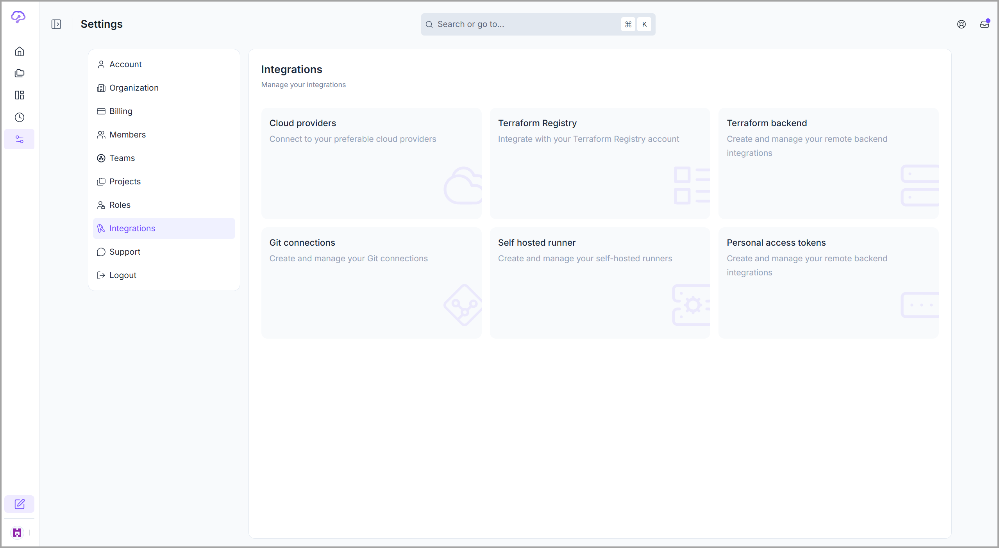

# Integrations

### Description

This is the central place to configure all your [integrations](https://app.brainboard.co/settings/integrations), whether the communication is from <mark style="color:$primary;">**Brainboard**</mark> to the outside world or from external systems to <mark style="color:$primary;">**Brainboard.**</mark>

<figure><figcaption></figcaption></figure>

