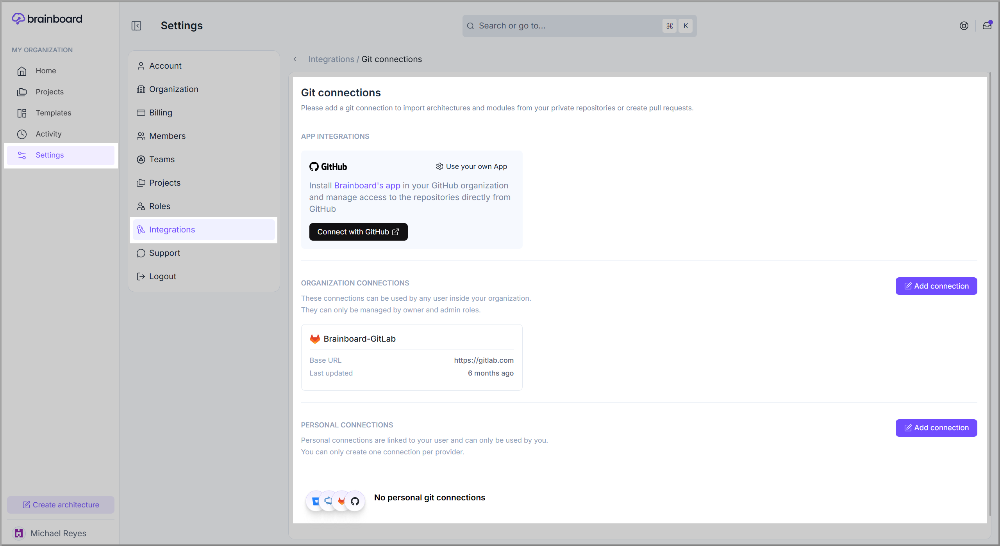

# Git configuration

### Description

This [settings page](https://app.brainboard.co/settings/integrations/git) allows you to configure access to your **Git** repositories so you can either **push** the code to them or **pull** the code if you are migrating to <mark style="color:$primary;">**Brainboard**</mark>.

<figure><figcaption></figcaption></figure>

### Types of connections

There are <mark style="color:$primary;">**three**</mark> types of **Git** connections.&#x20;

#### **1. Git app integrations**

This is a mechanism that allows you to control access to repositories and users from your git provider and not inside <mark style="color:$primary;">**Brainboard.**</mark>

This means that with this integration, users don't use their personal git tokens.

When doing **Pull Requests**, <mark style="color:$primary;">**Brainboard**</mark> sends the information on behalf of the user creating the **PR** to be able to track who does what.


For now, only **GitHub** has an app integration.


#### **2. Organization connections**

You can configure access to your **Git** repository in a way that any user inside your organization can use it. It may be helpful if you don't want your users to manage **Git** connections, so they can see all projects and do pull requests to any one of them.

#### 3. Personal connections

**Git** personal tokens are used by every user individually. So the users will be able to see only the projects and repositories they have access to, and when they do pull requests, you can identify exactly who did it.

### Supported Git providers

Brainboard supports the following Git providers:

1. [github.md](github.md "mention")
2. [ado.md](ado.md "mention")
3. [gitlab.md](gitlab.md "mention")
4. [bitbucket.md](bitbucket.md "mention")
