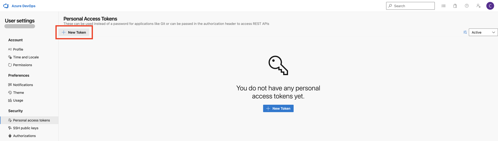
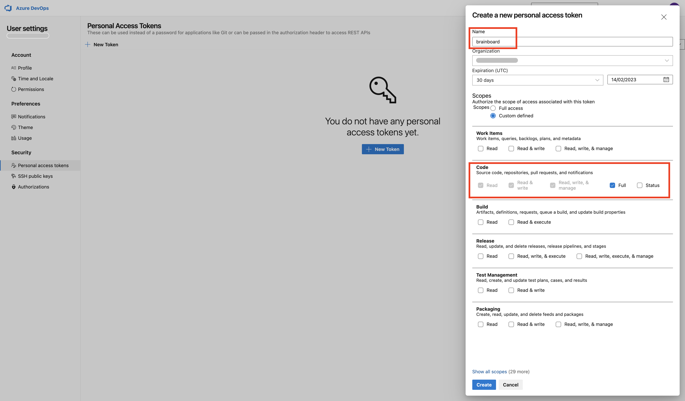
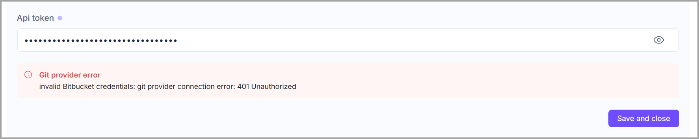
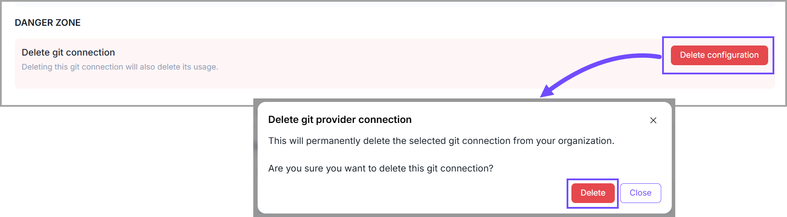

# Azure DevOps (ADO)

### Add Git connection

To add <mark style="color:blue;">**Azure DevOps**</mark> personal git tokens in <mark style="color:$primary;">**Brainboard**</mark><mark style="color:purple;">**,**</mark> you first need to generate an <mark style="color:blue;">**Azure DevOps**</mark> personal access token.

Steps to generate a <strong>personal access token</strong> on your <strong>Azure DO</strong> account.

1. Go to your [Azure DO page](https://dev.azure.com/).
2.  Click on the top-right icon and then select <mark style="color:blue;">**`Personal access tokens`**</mark>:

    <figure><figcaption></figcaption></figure>
3.  It will open the **Personal Access Tokens** page. Click on <mark style="color:blue;">**`New token`**</mark> button.

    <figure><figcaption></figcaption></figure>
4. In the modal, add the following information:
   * **Name** of the token.
   * You can set an **expiration date.**
   *   In the <mark style="color:blue;">**`code`**</mark> section, select <mark style="color:blue;">**`Full`**</mark><mark style="color:blue;">**&#x20;**</mark><mark style="color:blue;">**.**</mark>

       <figure><figcaption></figcaption></figure>
5.  Once the token is generated, you can copy it to add to <mark style="color:$primary;">**Brainboard**</mark><mark style="color:purple;">**.**</mark>

    <figure><figcaption></figcaption></figure>

#### Steps to add the generated token in <mark style="color:$primary;">**Brainboard**</mark>

1. Go to the [Git connections](https://app.brainboard.co/settings/integrations/git) page. Or, navigate to the path: <mark style="color:$primary;">**Settings > Integrations ? Git Connections.**</mark>&#x20;
2. Click on <mark style="color:$primary;">**`Add connection`**</mark>**&#x20;**<mark style="color:purple;">**.**</mark>
3. Switch to the <mark style="color:$primary;">**`Azure DevOps`**</mark> tab.

<figure><figcaption></figcaption></figure>

4. Add your credentials in the displayed window.

* **Name** of the token. This is only for Brainboard, it will not be used when you do a pull request.
* The **URL** of your **Azure DevOps organization**.
  *   To get this URL, the simplest way is to click on <mark style="color:$primary;">**`Azure DevOps`**</mark> on the top-left button, then copy the URL from the browser

      <figure><figcaption></figcaption></figure>
* **Token:** The token (secret) generated from your **Azure DevOps** account.

5. Then click the <mark style="color:$primary;">**`Save and close`**</mark> button.
6. <mark style="color:$primary;">**Brainboard**</mark> will verify if the credentials are valid:
   1.  **Valid credentials:** In this case, <mark style="color:$primary;">**Brainboard**</mark> displays a success message, and you can see the integration now in the **Git** connection page. 

       <figure><figcaption></figcaption></figure>
   2. **Invalid credentials:** In this case, you'll receive an error about what is wrong. For example, the one shared below.&#x20;

<figure><figcaption></figcaption></figure>

### How to use

Please refer to the page [pull-requests.md](pull-requests.md "mention") to understand how you can use your **Git** connections, whether you want to do a pull request and import your code from Git.

### Edit or delete connection

1. Go to the [Git connections](https://app.brainboard.co/settings/integrations/git) page.
2. Click on the connection that you want to delete.&#x20;
3. Click on the <mark style="color:red;">**`Delete Configuration`**</mark> button given at the bottom right corner of the page.
4. Click on the <mark style="color:red;">**`Delete`**</mark> button again to confirm your action.&#x20;

<figure><figcaption></figcaption></figure>

