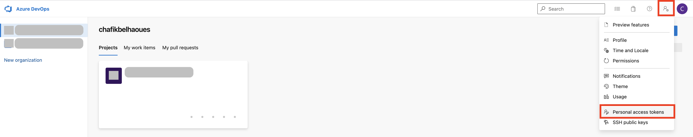
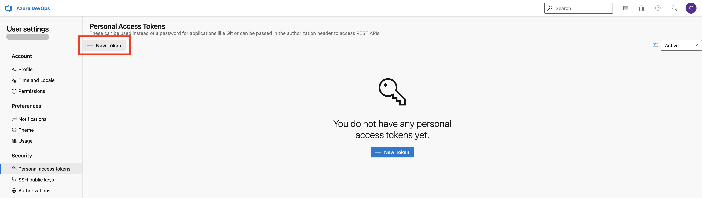
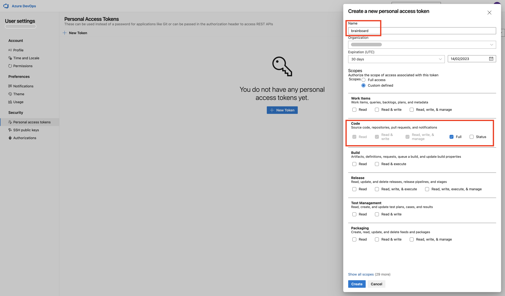
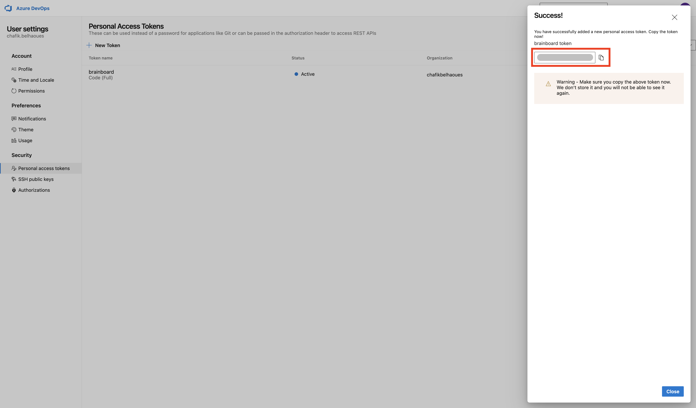
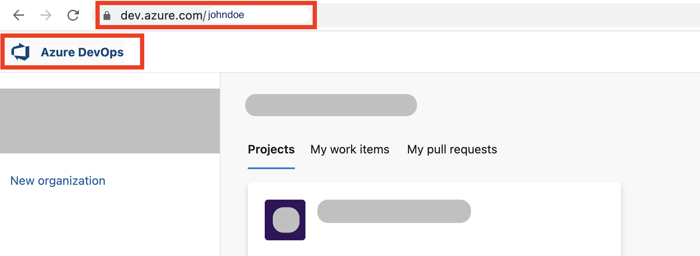

# Azure DevOps (ADO)

### Add Git connection

To add Azure DevOps personal git tokens in Brainboard, you first need to generate an Azure DevOps personal access token.

Steps to generate a personal access token on your <strong>Azure DO</strong> account.

1. Go to your [Azure DO page](https://dev.azure.com/).
2.  Click on the top right icon and then select `Personal access tokens`:&#x20;

    <figure><figcaption></figcaption></figure>
3.  It will open the page of access tokens. Click on `New token` button.&#x20;

    <figure><figcaption></figcaption></figure>
4. In the menu, add the following information:
   * Name of the token.
   * You can set an expiration date.
   *   In the `code` section, select `Full`&#x20;

       <figure><figcaption></figcaption></figure>
5.  The token is generated, you can copy it to add to Brainboard:&#x20;

    <figure><figcaption></figcaption></figure>

To add the generated token in Brainboard:

1. Go to the [Git integration](https://app.brainboard.co/settings/integrations/git) settings page.
2. Click on `Integrations`
3. In the section `Personal connections` Click on `Add connection`&#x20;
4.  Select `Azure DevOps` tab 

    <figure><figcaption></figcaption></figure>
5. Add your credentials in the displayed window:
   * Name of the token. This is only for Brainboard, it will not be used when you do a pull request.
   * The URL of your Azure DevOps organization.
     *   To get this URL, the simplest way is to click on `Azure DevOps` on the top-left button then copy the URL of the browser&#x20;

         <figure><figcaption></figcaption></figure>
   * Token: the token (secret) generated from your Azure DO account.&#x20;
6. Then click on `Save and close` button.
7. Brainboard will verify if the credentials are valid:
   1.  If they are valid, Brainboard displays a success message and you can see the integration now in the Git connection page 

       <figure><figcaption></figcaption></figure>
   2.  If they are not, you'll receive an error about what is wrong. For example: 

       <figure><figcaption></figcaption></figure>

       <figure><figcaption></figcaption></figure>

### How to use

Please refer to the page [pull-requests.md](pull-requests.md "mention") to understand how you can use your git connections whether you want to do a pull request and import your code from Git.

### Edit or delete connection

1. Go to the [Git integration](https://app.brainboard.co/settings/integrations/git) settings page.
2. Click on `Integrations`
3. In the section `Personal connections` Click on the `Azure DevOps` integration that you want to edit or delete
4. Select the action you want to perform from the view

<figure><figcaption></figcaption></figure>
