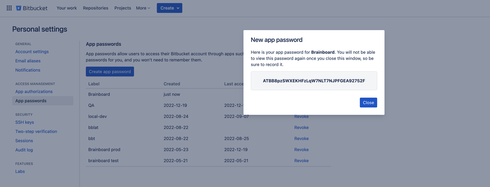

# Bitbucket

### Add Git connection

To add Bitbucket personal app password in Brainboard, you first need to generate it in your Bitbucket account.

Steps to generate a personal app password on your <strong>Bitbucket</strong> account.

1. Go to your [Bitbucket app passwords page](https://bitbucket.org/account/settings/app-passwords/).
2. Click on the top right icon and then select `Personal settings`:
   * Got to `App passwords` accessible from the left bar options.
   *   Click on `Create app password`.&#x20;

       <figure><figcaption></figcaption></figure>
3. Add a name and grant `read-write` access for:
   * Projects.
   * Repositories.
   *   Pull requests.&#x20;

       <figure><figcaption></figcaption></figure>
4.  The token is generated, you can copy it to add to Brainboard:&#x20;

    <figure><figcaption></figcaption></figure>

To add the generated token in Brainboard:

1. Go to the [Git integration](https://app.brainboard.co/settings/integrations/git) settings page.
2. Click on `Integrations`
3. In the section `Personal connections` Click on `Add connection`&#x20;
4.  Select `Bitbucket` tab 

    <figure><figcaption></figcaption></figure>
5. Add your credentials in the displayed window:
   * Name of the token. This is only for Brainboard, it will not be used when you do a pull request.
   * The URL of your Bitbucket server: by default Brainboard uses `https://api.bitbucket.org/2.0` but you can set your own URL.
   *   Username: this is `not` your email. You get it from your personal Bitbucket [account settings](https://bitbucket.org/account/settings/).  

       <figure><figcaption></figcaption></figure>
   * Password: the app password generated from your Bitbucket account.&#x20;
6. Then click on `Save and close` button.
7. Brainboard will verify if the credentials are valid:
   1.  If they are valid, Brainboard displays a success message and you can see the integration now in the Git connection page 

       <figure><figcaption></figcaption></figure>
   2.  If they are not, you'll receive an error about what is wrong. For example: 

       <figure><figcaption></figcaption></figure>

       <figure><figcaption></figcaption></figure>

### How to use

Please refer to the page [pull-requests.md](pull-requests.md "mention") to understand how you can use your git connections whether you want to do a pull request and import your code from Git.

### Edit or delete connection

1. Go to the [Git integration](https://app.brainboard.co/settings/integrations/git) settings page.
2. Click on `Integrations`
3. In the section `Personal connections` Click on `Bitbucket` integration that you want to edit or delete
4. Select the action you want to perform from the view

<figure><figcaption></figcaption></figure>
