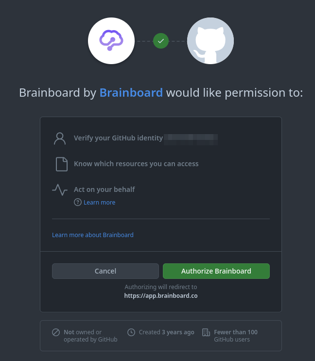
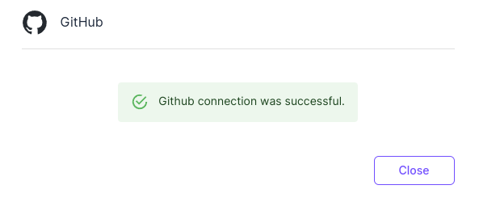

# GitHub

### Configure GitHub integration

To create integration between Brainboard and GitHub:

1. Go to the [Git integration](https://app.brainboard.co/settings/integrations/git) settings page.
2. Click on `Integrations`
3. Click on  `Connect with GitHub`

<figure><figcaption></figcaption></figure>

You'll be redirected to the GitHub website, where you can choose the organization for which you want to configure access:&#x20;

<figure><figcaption></figcaption></figure>

After selecting the organization, you are prompted to specify the repositories:&#x20;

**N.B:** Brainboard requires `read-write` access to be able to do pull requests.

<figure><figcaption></figcaption></figure>

After selecting the repositories, you'll be automatically redirected to Brainboard Git app settings page. Now the button should have changed to `View GitHub integration`. &#x20;


Brainboard Enterprise SSO users: If your organization uses Brainboard Enterprise SSO for authentication, the redirection to Brainboard app will fail after selecting the repositories. In this case, please contact our support to update your GitHub `installation_id`.


Once the connection is configured successfully, it will be you should it with a green indication

<figure><figcaption></figcaption></figure>

### Enable personal connection

1.  Once the GitHub app integration is done you need to click on `Add connection` in `Personal connections` section. This will open the settings where you can allow Brainboard to do pull requests on your behalf by clicking on `Connect with Github`\

    <figure><figcaption></figcaption></figure>

    If the Git app integration is not configured, Brainboard will display a warning as it has to be done first\

    <figure><figcaption></figcaption></figure>
2.  The GitHub website will open in a new tab, asking you to authorize Brainboard app to access your GitHub account. Click on the `Authorize Brainboard` button:

    
3.  You will then be redirected to Brainboard personal git tokens page, with a confirmation that the GitHub connection was successful:

    

### Edit GitHub integration

To edit the GitHub integration:

1. Go to the [Git integration](https://app.brainboard.co/settings/integrations/git) settings page.
2. Click on `Integrations`
3. Click on  `Access GitHub`
4. You'll be redirected to the GitHub website, where you can edit the integration with Brainboard.

### Delete GitHub integration

To delete integration with GitHub:

1. Go to the [Git integration](https://app.brainboard.co/settings/integrations/git) settings page.
2. Click on `Integrations`&#x20;
3.  You need to delete your personal connection first by clicking on it in the section `Personal connectio` then click on `Delete configuration`

    <figure><figcaption></figcaption></figure>
4. Go back to the page of Git connections and click on  `Access GitHub`
5.  You'll be redirected to the GitHub website, where you can delete the integration with Brainboard.\

    <figure><figcaption></figcaption></figure>


The update will be immediate, and you will no longer be able to do pull requests.

