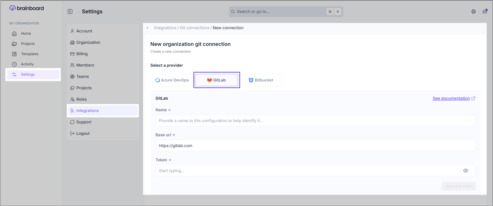

# GitLab

### Add Git connection

To add a <mark style="color:blue;">**GitLab**</mark> personal **Git token** in <mark style="color:$primary;">**Brainboard**</mark>, you first need to generate it in your <mark style="color:blue;">**GitLab**</mark> account.

<strong>Steps to generate a personal Git token on your </strong><mark style="color:blue;"><strong>GitLab</strong></mark><strong> account.</strong>

1. Go to your **GitLab**[ personal tokens page](https://gitlab.com/-/profile/personal_access_tokens).
2.  Add a name and specify <mark style="color:blue;">**`API`**</mark> rights, then click on <mark style="color:blue;">**`Create personal access token`**</mark> button. 

    <figure><figcaption></figcaption></figure>
3.  Once the token is generated, you can copy it to add to <mark style="color:$primary;">**Brainboard**</mark>. 

    <figure><figcaption></figcaption></figure>

#### Steps to add the generated token in Brainboard.

1. Go to the [Git connections](https://app.brainboard.co/settings/integrations/git) page.
2. Click on <mark style="color:$primary;">**`Add connection`**</mark> .
3. Switch to the <mark style="color:$primary;">**`GitLab`**</mark> tab.

<figure><figcaption></figcaption></figure>

4. Add your credentials in the displayed window.&#x20;

* **Name** of the token. This is only for <mark style="color:$primary;">**Brainboard**</mark>; it will not be used when you do a pull request.
* The **URL** of your <mark style="color:blue;">**GitLab**</mark> server. By default, <mark style="color:$primary;">**Brainboard**</mark> uses <mark style="color:$primary;">**`https://gitlab.com`**</mark>, but if you have a private <mark style="color:blue;">**GitLab**</mark> instance accessible through the internet or if you use a **single-tenant** <mark style="color:$primary;">**Brainboard**</mark> offering, you can specify a different URL.

5. Then click the <mark style="color:$primary;">**`Save and close`**</mark> button.
6. <mark style="color:$primary;">**Brainboard**</mark> will verify if the credentials are valid:
   1.  **Valid credentials:** In this case, <mark style="color:$primary;">**Brainboard**</mark> displays a success message, and you can see the integration now on the <mark style="color:$primary;">**Git connections**</mark> page.  

       <figure><figcaption></figcaption></figure>
   2. **Invalid credentials:** In this case, you'll receive an error about what is wrong. For example, the one shared below.&#x20;

<figure><figcaption></figcaption></figure>

### How to use

Please refer to the page [pull-requests.md](pull-requests.md "mention") to understand how you can use your **Git connections,** whether you want to do a pull request and import your code from **Git.**

### Edit or delete connection

1. Go to the [Git connections](https://app.brainboard.co/settings/integrations/git) page.
2. Click on the connection that you want to edit or delete.&#x20;
3. If you want to edit, simply make your changes and click the <mark style="color:$primary;">**`Save and close`**</mark> button.&#x20;
4. To delete, click on the <mark style="color:red;">**`Delete Configuration`**</mark> button given at the bottom right corner of the page.
5. Click on the <mark style="color:red;">**`Delete`**</mark> button again to confirm your action.&#x20;

<figure><figcaption></figcaption></figure>
