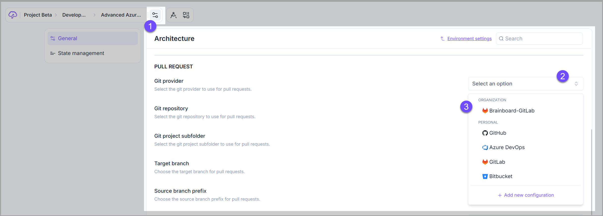
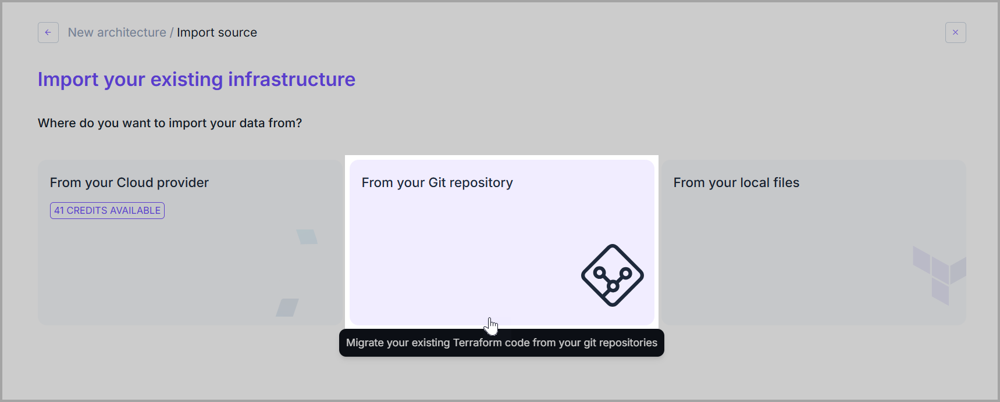
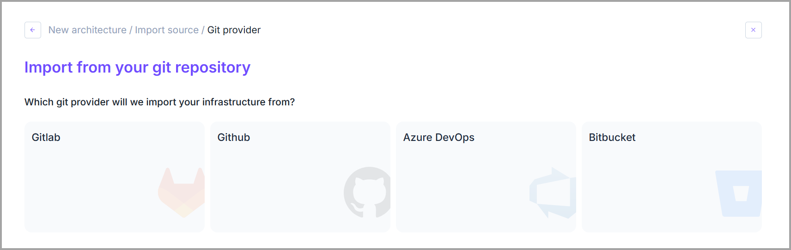
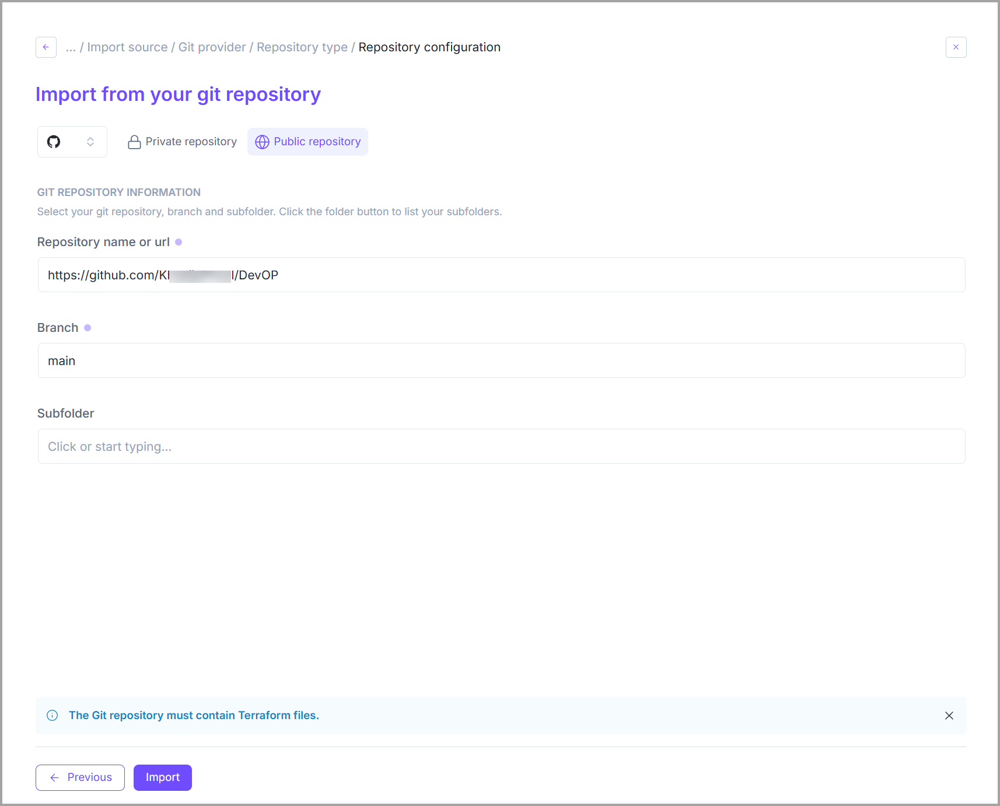

# How to use

### Push the code to Git (Pull Request)

A <mark style="color:blue;">**PULL**</mark> request allows you to push the generated **Terraform** code from <mark style="color:$primary;">**Brainboard**</mark> into your <mark style="color:blue;">**Git**</mark> repository.

It is similar to doing <mark style="color:blue;">**`git add .`**</mark>, <mark style="color:blue;">**`git commit -m 'commit message'`**</mark> and <mark style="color:blue;">**`git push`**</mark> on your laptop.

#### How to do a Pull Request

When you do a <mark style="color:blue;">**PULL**</mark> request, <mark style="color:$primary;">**Brainboard**</mark> packages all the generated files for your infrastructure, does the pull request into the git repository that you configure and gives you back the link to the PR.

Here is important information on how it works:

1. You first have to set up the integration between <mark style="color:$primary;">**Brainboard**</mark> and your <mark style="color:blue;">**Git**</mark> repository. Refer to these pages to do the integration with:
   * [github.md](github.md "mention")
   * [ado.md](ado.md "mention")
   * [gitlab.md](gitlab.md "mention")
   * [bitbucket.md](bitbucket.md "mention")
2. Select the <mark style="color:blue;">**Git**</mark> credentials you want to associate with your architecture in the settings page of the architecture.&#x20;

<figure><figcaption></figcaption></figure>

3. You can also configure the <mark style="color:blue;">**Git**</mark> repository, source and target branch, and the default files to be included in the **PR**.&#x20;

<figure><figcaption></figcaption></figure>

4. In the design area, on the right, click on <mark style="color:$primary;">**`Pull request`**</mark> button.

<figure><figcaption></figcaption></figure>

This will open the modal of the **PR** where you can customize the commit message, the title, description and also select the files you want/don't want to push to <mark style="color:blue;">**Git**</mark>.

<figure><figcaption></figcaption></figure>

6. <mark style="color:$primary;">**Brainboard**</mark> pushes only the difference between the branches, as it does git pull first before pushing.

### Import from Git

You can import your existing **Terraform** code from your repository directly in <mark style="color:$primary;">**Brainboard**</mark><mark style="color:$primary;">.</mark>

To do so:

1. Click on <mark style="color:$primary;">**`New architecture`**</mark> .
2. Select <mark style="color:$primary;">**`Import from your infrastructure`**</mark>.

<figure><figcaption></figcaption></figure>

3. Select <mark style="color:$primary;">**`From Git repository`**</mark> .

<figure><figcaption></figcaption></figure>

3. Select your <mark style="color:blue;">**Git**</mark> provider.

<figure><figcaption></figcaption></figure>

4. This will open the dedicated import page of your <mark style="color:blue;">**Git**</mark> provider.&#x20;

<figure><figcaption></figcaption></figure>

5. Click on <mark style="color:$primary;">**`Import`**</mark> to initiate the import from <mark style="color:blue;">**Git.**</mark>

### Best practices

1. It's a best practice to **push clean code**, so before you do a <mark style="color:blue;">**PULL**</mark> request, make sure that your architecture and the generated code fulfil the following criteria.&#x20;


The architecture and the generated code are **working properly**. Try to have at least a <mark style="color:$primary;">**`plan`**</mark> succeeding before doing a PR.



&#x20;**respect your budget**. Use the <mark style="color:$primary;">**Brainboard**</mark>**&#x20;CI/CD** engine to integrate costs into your pipeline of tests and make sure it's under budget.



The architecture and the generated code are **secure**. Add security checks like <mark style="color:$primary;">**TFSEC, Checkov**</mark> and even policy as code like <mark style="color:$primary;">**OPA**</mark> into your pipelines.


Refer to the [CI/CD engine](../../../automation/ci-cd-designer.md) to know how to build your pipelines.

2. **Rotate** your personal **Git** tokens regularly.

