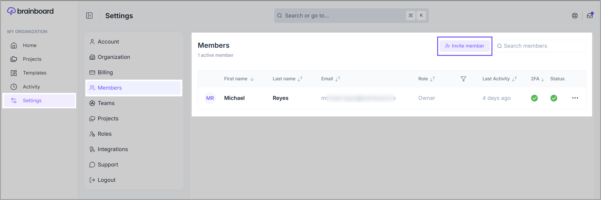
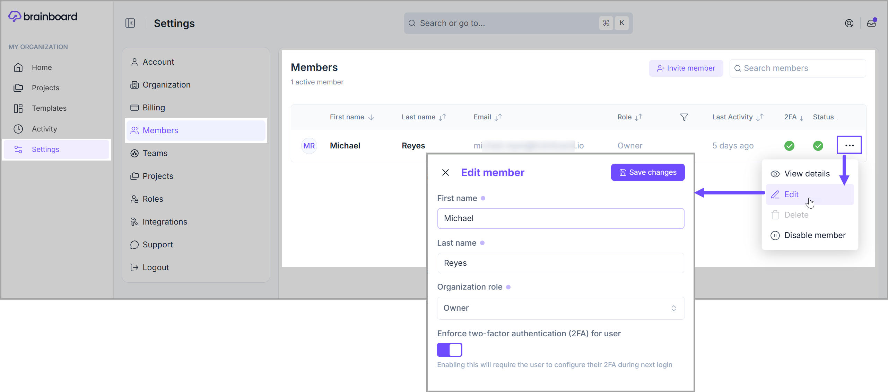
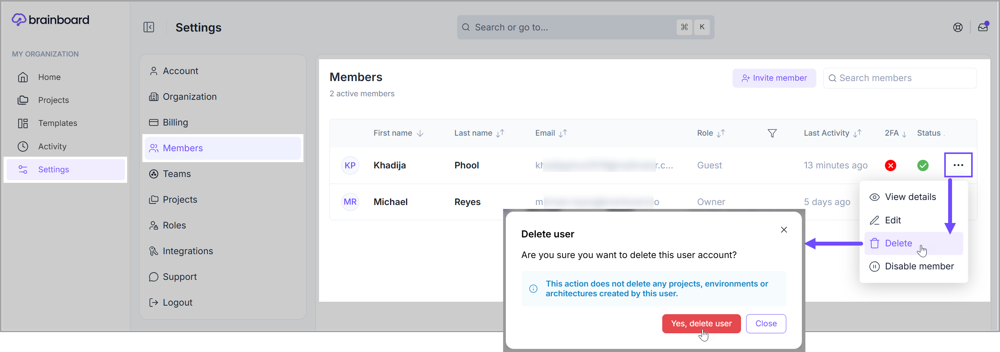

# Members

### Add members

You can invite your colleagues, customers, auditors or external contributors to your <mark style="color:$primary;">**Brainboard**</mark> organization.

To invite a new member:

1. Go to the [Members page](https://app.brainboard.co/settings/members).
2. Click on the <mark style="color:$primary;">**`Invite member`**</mark> button.&#x20;

<figure><figcaption></figcaption></figure>

1. Add the following information and click <mark style="color:$primary;">**`Send invite`**</mark>:
   * **Email** address.
   * The <mark style="color:$primary;">**`organization`**</mark> role that you want this user to have. There are <mark style="color:$primary;">**four roles**</mark> available:
     * **Owner**: Can do any action in <mark style="color:$primary;">**Brainboard.**</mark>
     * **Admin**: Can do most of the actions, except billing.
     * **Member**: Can only perform actions authorized on specific projects.
     * **Guest**: This is read-only access. Suitable for auditors or team members that only need to view cloud architectures.
   * The initial **team** of the user.

<figure><figcaption></figcaption></figure>


A member can belong to **one and only one** organization, so if the user you are trying to invite already has an account in Brainboard. This user should delete his/her organization following [this documentation](organization.md#delete-an-organization-close-your-account).


### Edit member's information

To edit a user's information:

1. Go to the [Members page](https://app.brainboard.co/settings/members).
2. Click on the <mark style="color:$primary;">**`Edit`**</mark> option in the **dropdown menu** that appears when you click on the **three dots** icon at the end of the member's record row.
3. You can change the _<mark style="color:$primary;">first name, last name,</mark>_ _<mark style="color:$primary;">organization role,</mark>_ and _<mark style="color:$primary;">two-factor authentication status</mark>_ of the user.

<figure><figcaption></figcaption></figure>

### Disable members

You can temporarily suspend a user, which implies that the account still exists within your organization, but the user cannot access <mark style="color:$primary;">**Brainboard**</mark> unless you enable it again.


When you disable a user, you will not be billed for this user until you enable it again.


To suspend a member:

1. Go to the [Members page](https://app.brainboard.co/settings/members).
2. Click on the <mark style="color:$primary;">**`Disable member`**</mark> option in the **dropdown menu** that appears when you click on the **three dots** icon at the end of the member's record row.
3. Click on the <mark style="color:$primary;">**`Disable member`**</mark>  button in the confirmation modal.&#x20;

<figure><figcaption></figcaption></figure>

### Remove members

To remove any member from your organization:

1. Go to the [Members page](https://app.brainboard.co/settings/members).
2. Click on the <mark style="color:$primary;">**`Delete`**</mark> option in the **dropdown menu** that appears when you click on the **three dots** icon at the end of the member's record row.&#x20;
3. Click on <mark style="color:$primary;">**`Yes, delete user`**</mark> in the confirmation window that will show.

<figure><figcaption></figcaption></figure>

