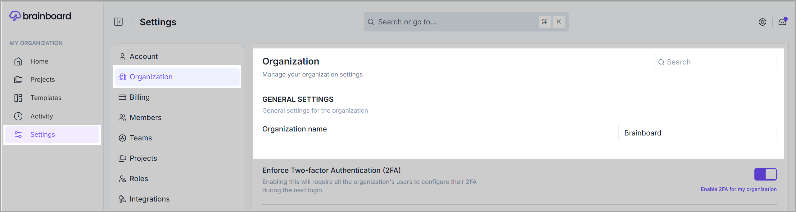
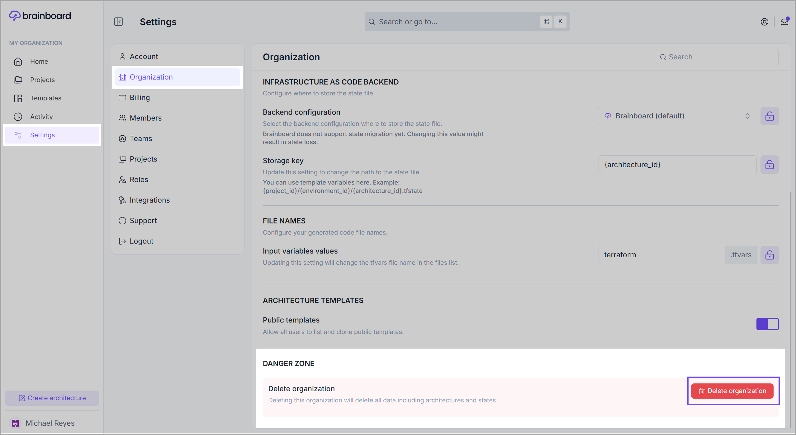

# Organization

### Description

The **Organization** is a common space that is supposed to host projects accessible to the same group of people or teams.

The first account created on <mark style="color:$primary;">**Brainboard**</mark> will be, by default, the owner of the organization and <mark style="color:$primary;">**Brainboard**</mark> creates a _<mark style="color:$primary;">new team</mark>_ and a _<mark style="color:$primary;">new project</mark>_ for this account as part of the onboarding process.


If you are planning to work with your colleagues in the same organization, you should invite them or add them to the same **SSO** group.


### Create a new organization

The organization is automatically created upon sign-up.

### Join an existing organization

To join an existing organization, you need to be invited by an organization <mark style="color:$primary;">**`owner`**</mark> or <mark style="color:$primary;">**`admin`**</mark>.

Once invited, click on the link received by email.

### Rename an organization

To rename the organization:

1. Access its [settings page](https://app.brainboard.co/settings/organization).
2. Update the **Organization name.**

<figure><figcaption></figcaption></figure>

### Delete an organization (close your account)

To delete an organization:

1. Go to the [organization settings page](https://app.brainboard.co/settings/organization).
2. Scroll down to the <mark style="color:red;">**`DANGER ZONE`**</mark> and then click on <mark style="color:$primary;">**`Delete organization`**</mark> button.

<figure><figcaption></figcaption></figure>

### Default organization roles

There are four default roles within the organization.

#### 1. Owner

The <mark style="color:$primary;">**owner**</mark> of the organization can perform any action. It is usually the first account created.

#### 2. Admin

The <mark style="color:$primary;">**admin**</mark> can perform any action on the organization except deleting it and managing billing information.

#### 3. Member

At the organization level, a <mark style="color:$primary;">**member**</mark> can:

* List other members
* List and create teams
* List and create projects.


<mark style="color:$primary;">**Members**</mark> cannot invite users or delete them. They cannot see or change the billing, and they only see projects they have access to and not all projects.


#### 4. Guest

A <mark style="color:$primary;">**Guest**</mark> is a read-only user that only has access to projects that admins or owners have allowed it to access.


By default, a guest has access to nothing.



To create new roles or customize existing one, please refer to the [roles page](rbac/).

