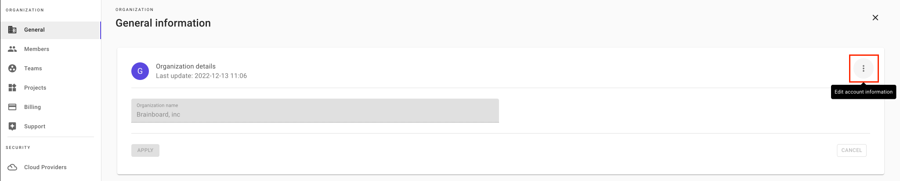
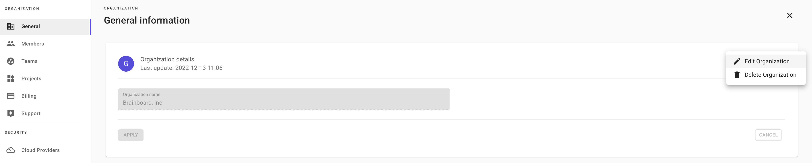
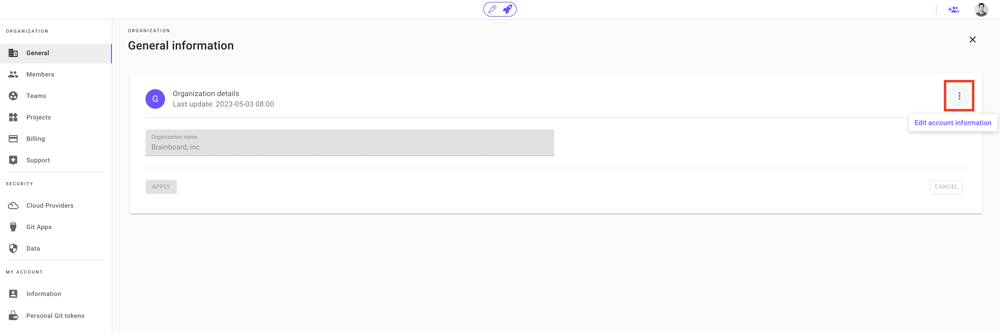

# Organization

### Description

The Organization is a common space that is supposed to host projects accessible to the same group of people or teams.

The first account created on Brainboard will be, by default, the owner of the organization and Brainboard creates automatically a new team and new project for this account as part of the onboarding process.


If you are planning to work with your colleagues in the same organization, you should invite them or add them to the same SSO group.


### Create a new organization

The organization is automatically created on sign up.

### Join an existing organization

To join an existing organization, you need to request access from the organization `owner` or `admin`.

* Please refer to the [invite members](https://gitlab.com/brainboard/brainboard/-/blob/main/account-billing/invite-members/README.md) to invite new members.
* Once invited, click on the link received by mail.
* Fill your information in the invitation page:
  * First name
  * Last name
  * Password
* Click join to accept the invitation and join the organization.

### Rename an organization

To rename the organization:

1. Access its [setting page](https://app.brainboard.co/settings/general)
2.  Click on the 3 dots on the right:&#x20;

    <figure><figcaption></figcaption></figure>
3.  Click on `Edit Organization` to change its name:&#x20;

    <figure><figcaption></figcaption></figure>

### Delete an organization (close your account)

To delete an organization:

1. Go to the [organization settings page](https://app.brainboard.co/settings/general)
2.  Click on the 3 dots on the right and select `Delete Organization`&#x20;

    <figure><figcaption></figcaption></figure>
3. Type `DELETE` in capital letters in the confirmation page and click on the `Apply` button

### Roles within an organization

There are `4 roles` within the organization.

#### 1. Owner

The owner of the organization can perform any action. It is usually the first account created.

#### 2. Admin

The admin can perform any action on the organization except deleting it and managing billing information.

#### 3. Member

At the organization level, a member can:

* List other members
* List and create teams
* List and create projects.

Members cannot invite users or delete them. They cannot see or change the billing and they only see projects they have access to and not all projects.

#### 4. Guest

Guest is a read-only user that only has access to projects that admins or owners allowed it to access.

By default, a guest has access to nothing.

### IAM reference

To see the complete list of permissions in Brainboard refer to the [IAM page](broken-reference).
