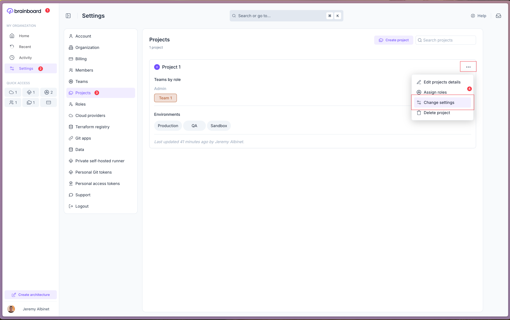
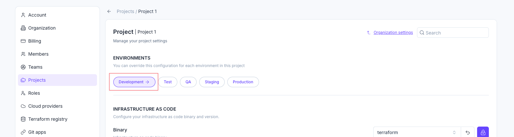

# Overview

## Settings

Settings in Brainboard provides a flexible and hierarchical configuration system allowing you to manage settings at different levels of your organization.&#x20;

### Overview

Settings in Brainboard are organized in a hierarchical structure that follows this inheritance pattern:

**Organization → Project → Environment → Architecture**

This hierarchical approach ensures that configurations that are shared across the hierarchy can be managed efficiently while allowing for specific overrides at any level when needed.

### Accessing Settings

#### Organization Settings

You can access Organization settings pages from the home page through the left navigation menu:

1. Go to the Home page (click on Brainboard logo in the top-left corner)
2. Click on the Settings icon in the left sidebar
3. Select Organization

#### Project Settings

You can access Project settings pages from the home page through the left navigation menu:

1. Go to the Home page (click on Brainboard logo in the top-left corner)
2. Click on the Settings icon in the left sidebar
3. Click on Projects
4. Open the project menu using the 3-dots button, and click on "Change settings"

<figure><figcaption>
Access Project settings page
</figcaption></figure>

#### Environment Settings

You can access the Environment settings pages from the Project settings pages:

1. Access the Project settings following the instruction above
2. Click on the environment name from the horizontal listing

<figure><figcaption>
Access Environment settings page
</figcaption></figure>

#### Architecture Settings

1. Open your architecture
2. Switch to the settings tab (using the tab selector in the middle of the topbar)

<figure><figcaption>
Access Architecture settings page
</figcaption></figure>

### Hierarchical Settings Management

#### Inheritance Chain

Settings follow a clear inheritance structure:

1. **Organization Level**: The highest level, affects all projects, environments, and architectures.
2. **Project Level**: Overrides organization settings for all environments and architectures within the project
3. **Environment Level**: Overrides organization and project settings for all architectures within the environment
4. **Architecture Level**: The most specific level, overrides all higher-level settings for a particular architecture

#### Visual Indicators

When viewing settings at any level, you'll see visual indicators showing:

* When a setting is locked at higher level (with the source of the lock)
* When a setting is overridden at your level (the reset button shows that the value is set at this level)\
  
* When a setting is locked at your level preventing any lower levels update\
  
