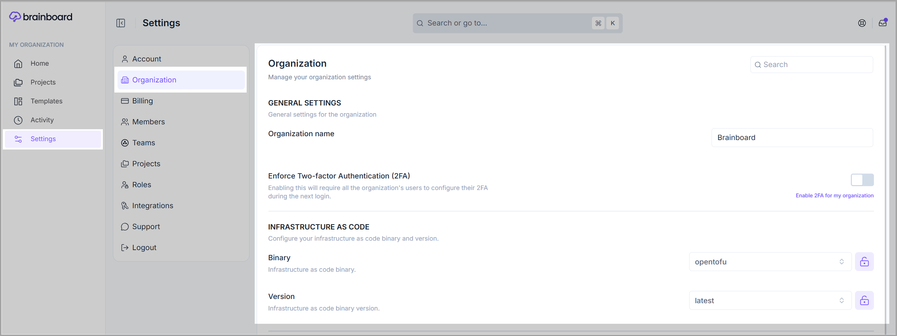
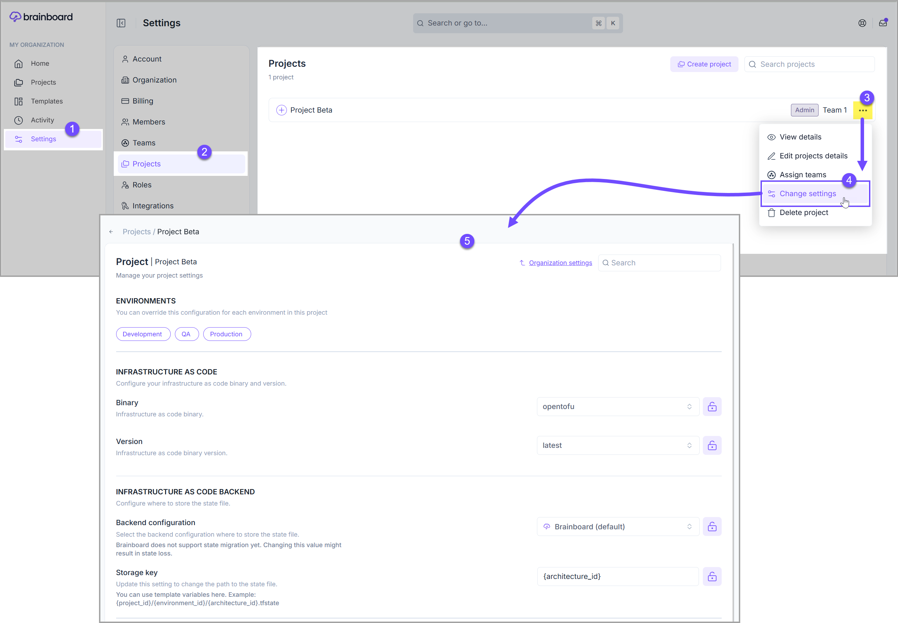
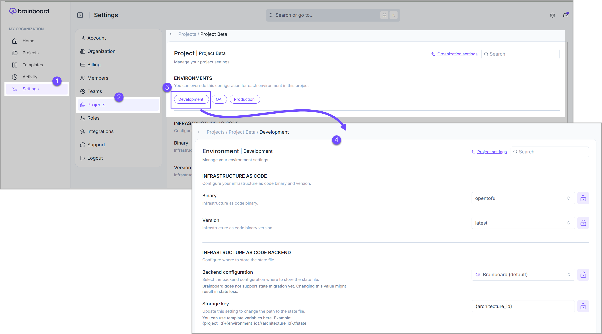
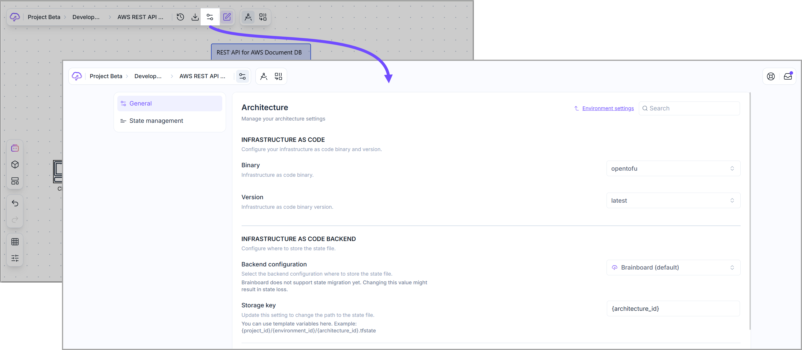
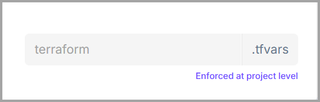
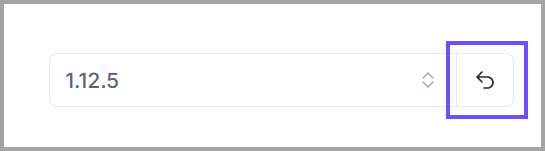
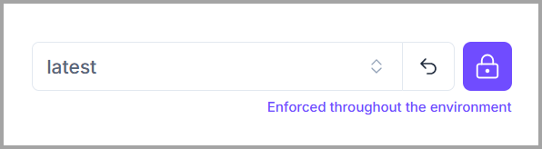

# Overview

## Settings

**Settings** in <mark style="color:$primary;">**Brainboard**</mark> provide a flexible and hierarchical configuration system allowing you to manage settings at different levels of your organization.

### Overview

Settings in <mark style="color:$primary;">**Brainboard**</mark> are organized in a hierarchical structure that follows this inheritance pattern.


**Organization → Project → Environment → Architecture**



This hierarchical approach ensures that configurations that are shared across the hierarchy can be managed efficiently while allowing for specific overrides at any level when needed.


### Accessing Settings

#### Organization Settings

To access the **Organization's settings,** go to the <mark style="color:$primary;">**`Settings`**</mark> option in the **left bar** and then click <mark style="color:$primary;">**`Organization`**</mark>**.** &#x20;

<figure><figcaption></figcaption></figure>

#### Project Settings

To access the **Project's settings,** go to the <mark style="color:$primary;">**`Settings`**</mark> option in the **left bar** and then click <mark style="color:$primary;">**`Projects`**</mark>**.** Then, click the **ellipsis** (three dots) against the project name and click <mark style="color:$primary;">**`Change Settings`**</mark> in the dropdown menu. It will navigate you to the project's settings page.&#x20;

<figure><figcaption></figcaption></figure>

#### Environment Settings

Once you are on the <mark style="color:$primary;">**Project settings**</mark> page, you can also view the associated environments at the top. Click on the desired environment to go to its settings page.&#x20;

<figure><figcaption></figcaption></figure>

#### Architecture Settings

1. Open your architecture.
2. Switch to the **settings** **tab** using the **settings icon** in the options bar at the top.&#x20;

<figure><figcaption></figcaption></figure>

### Hierarchical Settings Management

#### Inheritance chain

Settings follow a clear inheritance structure:

1. **Organization Level**: The highest level, affects all projects, environments, and architectures. 

<figure><figcaption>
Settings defined at organization level and not overridden at any lower level
</figcaption></figure>

2. **Project Level**: Overrides organization settings for all environments and architectures within the project

<figure><figcaption>
Setting defined at organization level being overridden at a project level
</figcaption></figure>

3. **Environment Level**: Overrides organization and project settings for all architectures within the environment

<figure><figcaption>
Setting defined at organization level being overridden at a project level and again at an environment level
</figcaption></figure>

4. **Architecture Level**: The most specific level, overrides all higher-level settings for a particular architecture

<figure><figcaption>
Setting defined at organization level being overridden at a project level , then overridden again at an environment level and finally at the architecture level
</figcaption></figure>

#### Visual Indicators

When viewing settings at any level, you'll see visual indicators showing:

1. When a setting is locked at a higher level (with the source of the lock).

<figure><figcaption></figcaption></figure>

2. When a setting is overridden at your level (the reset button shows that the value is set at this level).

3. When a setting is locked at your level, preventing any lower levels from updating. 

<figure><figcaption></figcaption></figure>
