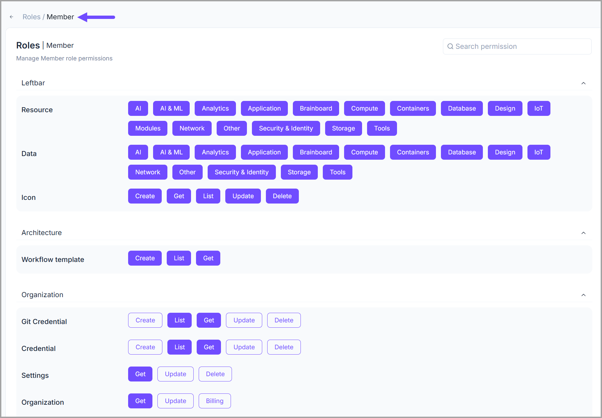

# Organization RBAC

In this section, you can _<mark style="color:$primary;">create</mark>_ and _<mark style="color:$primary;">customize</mark>_ roles that have permissions on <mark style="color:$primary;">**organization**</mark> objects. For example, _<mark style="color:$primary;">who</mark>_ is allowed to _<mark style="color:green;">add new members, change security settings, or add new teams</mark>_.


The categories of permissions that you can manage:

1. Leftbar
2. Architecture
3. Organization
4. Team
5. Terraform
6. User
7. Project
8. Credentials


For instance, the snapshot shared below gives a general idea of what a <mark style="color:$primary;">**member role**</mark> looks like at the <mark style="color:$primary;">**organization**</mark> level _(not all the allowed actions are captured in this image)_.&#x20;

<figure><figcaption></figcaption></figure>
