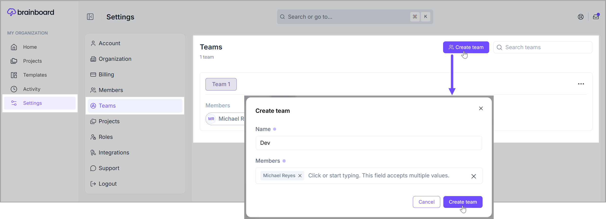
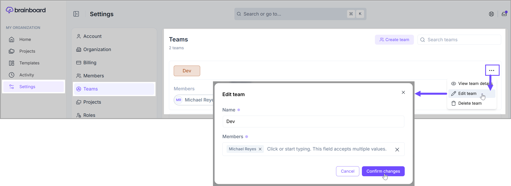
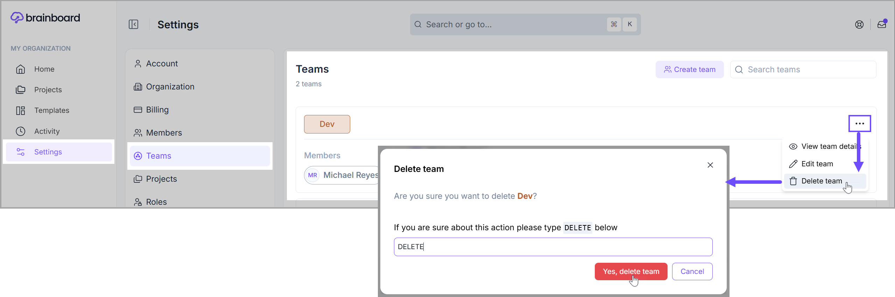

# Teams

### Create a new team

To create a new team in Brainboard:

1. Go to the [Settings page of Teams](https://app.brainboard.co/settings/teams).
2. Click on the <mark style="color:$primary;">**`Create team`**</mark>  button, and fill in the following information:&#x20;
   1. **Name**
   2. **Members**
3. Then, click the <mark style="color:$primary;">**`Create team`**</mark> button.&#x20;

<figure><figcaption></figcaption></figure>

### View team's information

To view the information on a team, click on the **ellipsis** (three dots icon), and then select the <mark style="color:$primary;">**`View team details`**</mark> option from the **dropdown** menu.&#x20;

<figure><figcaption></figcaption></figure>

### Edit team

To edit the information of a team, click on the **ellipsis** (three dots icon), and then select the <mark style="color:$primary;">**`Edit team`**</mark> option from the **dropdown** menu.&#x20;

After making the desired changes on the <mark style="color:$primary;">**Edit team**</mark> modal, click the <mark style="color:$primary;">**`Confirm changes`**</mark> button to save the new details.&#x20;

<figure><figcaption></figcaption></figure>

### Delete team

To delete a team, click on the **ellipsis** (three dots icon), and then select the <mark style="color:$primary;">**`Delete team`**</mark> option from the **dropdown** menu.&#x20;

On the <mark style="color:$primary;">**Delete team**</mark> confirmation prompt modal, type <mark style="color:red;">**DELETE**</mark> and click the <mark style="color:$danger;">**`Yes, delete team button`**</mark>.&#x20;

<figure><figcaption></figcaption></figure>


Deleting a team is an irreversible action.

