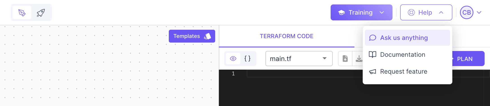

# Brainboard support 🤝

### While using Brainboard

When you are using Brainboard, you can reach out to us in real time by clicking on the button `Help` in the top right corner, then click on `Ask us anything`. One of our team members will reply to answer your questions or help you on any technical topic.

### Technical questions

If you prefer emails (asynchronous communication) or if you want to schedule a call to help you on a specific technical topic, you can reach out to our technical team at `support@brainboard.co`.

One of our cloud architects will help you.

### Access our security reports

To request access to our security reports like SOC 2 Type II, use this [portal](https://security.brainboard.co).

Your account manager or sales representative will approve your request, otherwise, the team will reach out to you before approval.

### Report security issues

To report a security issue, reach out to our security team at `security@brainboard.co`.

### Request a feature

To request a new feature or see what the community have requested, check our [public roadmap](https://roadmap.brainboard.co/boards/feature-requests).

### Request a demo

To request a demo of Brainboard, reach out to our sales team at `sales@brainboard.co`
