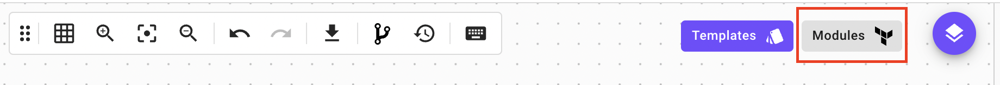

# Manage module 🍱

To manage modules within Brainboard you can go to the modules catalog.

On this page, you can see and manage all your imported modules and choose which ones you want to have displayed in the modules list in your design area by `pinning` them.

If you want to change the configuration of a module you can choose one of the modules in the list:

*   In the module configuration you can show the module in the design or remove it from the design by using the `pin` button.

    
* You can edit the configuration by using the `pen` button.
* You can delete the module by using the `bin` button.

:::tip

To have a more organized modules list in your design area, only `pin` the modules that are needed for a specific architecture. If you need more modules you can come later to the modules catalog and pin them.

:::
