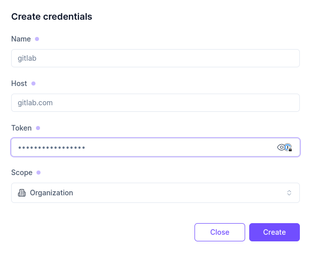

# Terraform registry credentials 🪪

In order to import Terraform modules from a [private registry](https://developer.hashicorp.com/terraform/registry/private), you need to provide the credentials to access the registry.

Registry credentials used by Terraform require two information:

* The hostname of your private registry
* The token used to authenticate with the registry

To add a new registry credentials, follow these steps:

1. Go to the [Registry credentials page](https://app.brainboard.co/settings/terraform-registry).
2.  Click on New credentials and set the credentials information in the displayed window:&#x20;

    * Name: Name of the credential
    * Host: Terraform registry hostname
    * Token: Terraform registry token
    * Scope:
      * Organization: credentials will be available to all users in the organization
    * User (myself): credentials will be available only to you :::warning Credentials scope can only be set at creation. You will not be able to change credentials scope after creation. :::

    <figure><figcaption></figcaption></figure>
3. Click on create to store your credential
